# 🤖 Oracle Integration Cloud AI Agent Project: Invoice Clarification Assistant

## 📌 Project Aim

The purpose of this project is to create an intelligent AI agent using **Oracle Integration Cloud (OIC)** and **OCI Generative AI** to automatically respond to vendor queries regarding **invoice clarifications**. The goal is to:

* Automate responses to common invoice-related queries
* Use natural language understanding to interpret free-form queries
* Dynamically invoke ERP APIs to retrieve financial data
* Generate human-like, contextual responses with LLMs
* Reduce manual workload on AP and finance teams

---

## 🏗️ Solution Architecture

### High-Level Flow

```
Customer Email / API
   ↓
OIC Receives Input (Email Adapter / REST Trigger)
   ↓
🧠 LLM Call 1: Intent Detection + Tool Selection
   ↓
OIC Calls ERP (via ERP Adapter) → Fetches invoice/payment details
   ↓
🧠 LLM Call 2: Response Generation using invoice data
   ↓
OIC Sends Response via Email Adapter
```



```mermaid
graph TD;
    A[Customer Email / API] --> B[OIC Receives input];
    B --> C[🧠 OIC Calls LLM : Intent Detection + Tool Selection];
    
    subgraph External Calls
        C -- User query,Tool List --> D[LLM]
        D -- Returns Tool to be used with appropriate inputs --> C
    end

    D --> E[OIC Calls ERP via Adapter];

    subgraph External Calls
        E -- Invoice Query data --> F[ERP];
        F -- invoice/payment details --> E;
    end

    F --> G[OIC calls LLM : Natural Language Response Generation using invoice data]
    subgraph External Calls
        G -- Invoice Data --> H[LLM]
        H -- Natural Language for email response --> G
    end    

    H --> I[OIC Sends Response via Email or API];   
  	style D color:#00BF63
	style H color:#00BF63  
    style F color:#FF3131  
```    

### Sequence Diagram


### Components

| Component             | Description                                     |
| --------------------- | ----------------------------------------------- |
| **OIC Email Adapter** | Trigger and reply channel for invoice queries   |
| **OCI Generative AI** | LLM-based intent detection and summarization    |
| **ERP Cloud Adapter** | Retrieves invoice and payment status            |
| **Integration Flow**  | Orchestrates all components in logical sequence |

---

## 🔧 Implementation Breakdown

### 1. **Trigger**

* Receives inbound email or API message from vendor
* Extracts invoice reference and question

### 2. **LLM Prompt #1: Intent Parsing**

Prompt sent to OCI GenAI:

```json
{
  "prompt": "You are a helpful AI Assistant capable of understanding user queries related to ERP such as invoices, purchase orders, receipts, general ledger, supply chain, customers, etc.  

    You work on start, plan, action, observe mode.
    For the given user query and available tools, plan the step by step execution.

    Based on the planning, select the relevant tool from the available tools 
    And based on the selected tool, perform the action to call the tool

    Based on the observation of the tool output, provide the final output to the user.

    Rules:
    - Follow the output json format
    - Always perform one step at a time and wait for next input
    - Carefully analyse the user query

Output JSON format:
{{"step":"string",
  "content":"string",
  "function":"The name of the function if step is an action",
  "input":"The input parameter for the function"
}}

Available tools:
- get_invoice: Gets informtion about an invoice
- get_invoices: Gets informtion about an multiple invoices based on dates
- get_po: Gets informtion about a purchase order

User Query:
{{user_query}}

Example:
User Query: I am looking for some informationo on the invoice I sent yesterday, INV-1234?
Output: {{ "step": "plan", "content": "User is interested in getting information about invoice." }}
Output: {{ "step": "plan", "content": "From the available tools, I should call get_invoice" }}
Output: {{ "step": "action", "function": "get_invoice", "search":"ID","value":"INV-1234" }}
Output: {{ "step": "output", "content":"This invoice is marked as PAID.  The payment was credited on 22-Sep-2024 via bank transfer no 631232 to Bank of America" }}

"""

 
}
```
We are using a Chain of Thought pattern here.  So the LLM is going to generate multiple responses.

After LLM identifies it is a query related to invoices, it will look at the tools available to choose the appropriate tool
Then it will generate the appropriate parmeters for the tool call

```json
{
  "action": "get_invoices",
  "parameters": {
    "search": "dates",
    "start": "2024-09-09",
    "end": "2024-09-10"
  }
}
```

### 3. **ERP Data Retrieval**
Now in the same flow, we will automatically make the tool call.  
* Use ERP Adapter/ REST Call to ERP to fetch:

  * Invoice header + line data
  * Payment status
  * Dispute notes or reason codes

### 4. **LLM Prompt #2: Business Explanation**
And then in the same flow, we will share the response of the ERP to LLM
```json
{
  "prompt": """You are a helpful AI Assistant, capable of formatting structured response into natural language response suitable to be sent to customers on email. 
  Given below is the raw data received for user query:
  {{user_query}}

  Context:
  The data received from ERP is:
  {{ERP Response}}

  Prepare a suitable response based on the user query and context provided.
  """
}
```

LLM returns response:

> "This invoice is marked as PAID.  The payment was credited on 22-Sep-2024 via bank transfer no 631232 to Bank of America "

### 5. **Email Reply**

* Compose response email with LLM output
* Send via OIC Email Adapter

---


## Architectural Decisions 
### 💰 Using OCI GenAI Over OpenAI
---

| Feature               | OCI GenAI                     | OpenAI / Other Clouds        |
| --------------------- | ----------------------------- | ---------------------------- |
| **Native to OIC**     | ✅ Yes                         | ❌ Manual setup required      |
| **Data Residency**    | ✅ Oracle Cloud native         | ❌ Shared infra / data egress |
| **Egress Cost**       | ✅ None                        | ❌ Extra cost per call        |
| **Security**          | ✅ Enforced IAM & OCI policies | ❌ Requires external auth     |
| **Model Flexibility** | ✅ Multi-model (Cohere, Llama) | ✅ GPT/Gemini/DeepSeek        |


### 💰 Using Chain of Thought based Agentic flow
---
We developed an Agentic AI flow with tool calling.  Using Chain-of-Thought (CoT) reasoning in such designs offers several advantages:
1. **Improved Decision-Making**
CoT allows AI agents to break down complex tasks into intermediate steps, ensuring that each tool call is deliberate and justified rather than reactive.
2. **Enhanced Interpretability**
By explicitly reasoning through each step, CoT makes AI decisions more transparent. This is crucial when AI agents interact with external tools like APIs, databases, or ERP systems, as it helps users understand why a tool was invoked.
3. **Better Error Handling**
Instead of blindly executing tool calls, CoT enables AI agents to reflect on previous steps, detect inconsistencies, and adjust their approach dynamically. This reduces errors and improves reliability.
4. **Optimized Tool Selection**
Agentic AI workflows often involve multiple tools. CoT helps AI evaluate different options before selecting the most appropriate tool, ensuring efficient resource utilization.
5. **Stronger Context Awareness**
CoT reasoning allows AI agents to retain context across multiple interactions, making them more adaptive when handling complex workflows that require multiple tool calls.
6. **Facilitates Multi-Step Planning**
Agentic AI often requires long-term planning. CoT enables AI to decompose tasks into logical steps, ensuring that tool calls are sequenced correctly for optimal results.


## 🚀 Future Enhancements

### 1. **Enhance with more tools**

* As of now tool supports invoice-related queries.  The tool can be easily extended to support more and more use cases by simply adding appropriate tools that connect with the appropriate API of Oracle ERP

### 2. **Multi-turn Conversations**

* Maintain memory using context variables
* Handle follow-ups like: "What about line 3 of that invoice?"

### 3. **Support Chat & WhatsApp**

* Extend via Oracle Digital Assistant for chatbot-style interactions

### 4. **Multi-language Support**

* Use GenAI for translation + response generation in Spanish, French, etc.


---

## 📂 Related Projects

* **HR Leave Bot**: Uses AI to fetch leave balance, policy, and entitlements
* **Procurement Agent**: Tracks open POs, vendor invoices, and approval status
* **IT Support AI**: Auto-resets passwords, unlocks accounts, and updates tickets

---

## 📌 Summary

This project demonstrates how to build an enterprise-grade **AI agent in Oracle Integration Cloud** using **OCI Generative AI**. It automates invoice and purchase order clarification with minimal human involvement, improving speed, accuracy, and customer experience.

If you're already on Oracle Cloud, this design is scalable, secure, and cost-effective to deploy with native integration options.
