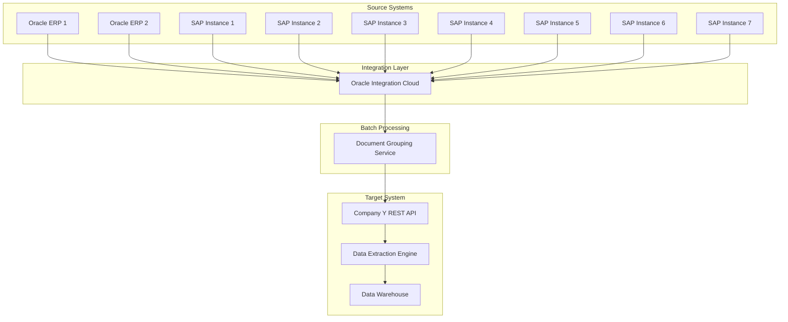
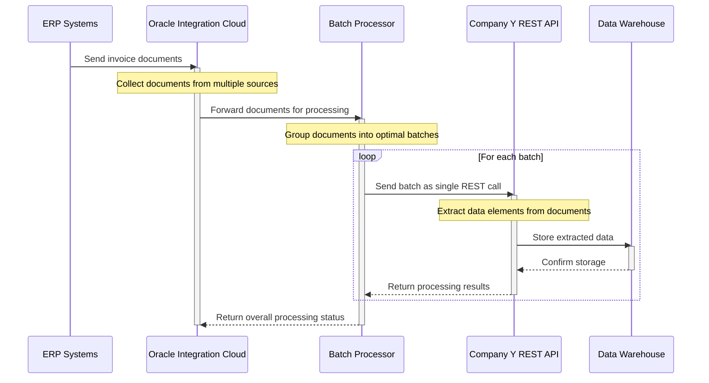

# Invoice Data Extraction and Integration Project

## Project Overview

This project implements a digital document processing solution that enables the extraction of data from various invoice formats (PDF, ZIP, XML) to meet federal requirements for digital data maintenance. The extracted data is stored in a searchable data warehouse, improving data accessibility and analytics capabilities.

## Background

Organizations are federally required to maintain digital data records. However, many business documents such as invoices and purchase orders, while existing in digital formats (PDF, text), lack searchability and data extraction capabilities. This project bridges that gap by implementing an automated solution to extract valuable information from these documents.

Our organization (X) has partnered with industry-leading data extraction company (Y) that specializes in scanning invoice files and identifying key elements. The solution is being implemented incrementally across multiple ERP systems over a multi-year period.

## Architecture Overview

## Technical Challenge

The primary technical challenge was optimizing the number of API calls to the target system. While the target REST API could accept multiple documents in a single call, sending individual documents for a large volume of invoices would result in excessive API calls, potentially causing performance issues and rate limiting concerns.

## Solution: Batch Processing Pattern

To address this challenge, we implemented a batch processing pattern with the following characteristics:

1. Reads multiple invoice files from source systems
2. Groups them into optimally sized batches
3. Sends each batch as a single call to the target REST API

This approach significantly reduced the number of API calls while maintaining system performance and reliability.

## Process Flow

## Sequence Diagram

## Technical Stack

- **Source Systems**: 2 Oracle ERP instances and 7 SAP instances
- **Integration Platform**: Oracle Integration Cloud (OIC)
- **Communication Protocol**: REST API
- **Document Formats**: PDF, ZIP, XML
- **Target System**: Company Y data extraction service
- **Storage**: Searchable data warehouse

## Implementation Approach

The project follows an incremental approach, connecting one ERP system at a time. This phased implementation strategy allows for:

1. Thorough testing with each system
2. Refinement of the extraction process for each document type
3. Customization to handle system-specific document formats
4. Controlled rollout to minimize business disruption

## Benefits

- **Compliance**: Meets federal requirements for digital data maintenance
- **Searchability**: Transforms non-searchable documents into queryable data
- **Efficiency**: Reduces API calls through smart batching
- **Scalability**: Architecture supports addition of new source systems
- **Performance**: Optimized for handling large document volumes

## Future Enhancements

- Additional document type support
- Advanced analytics on extracted data
- Machine learning for improving extraction accuracy
- Real-time processing capabilities
- Enhanced reporting dashboards

## Project Status

This is a multi-year ongoing project being executed one ERP system at a time. Currently, we have successfully integrated:
- 2 Oracle ERP instances
- 7 SAP instances

Additional systems will be added according to the project roadmap.
