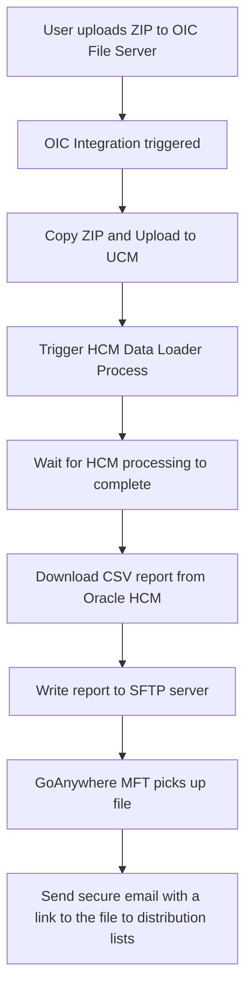
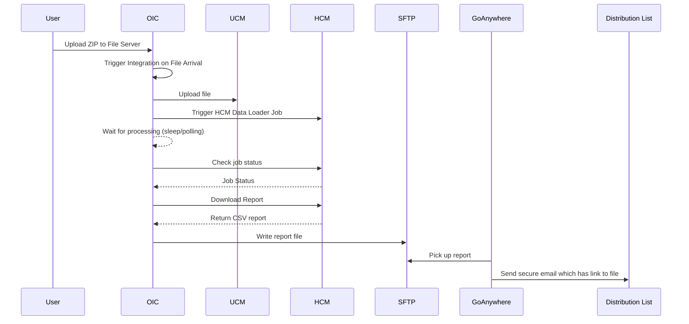

# OIC Project: HCM Data Loader Integration

This Oracle Integration Cloud (OIC) project automates a multi-step data handling process involving ZIP file ingestion, UCM upload, HCM Data Loader invocation, and final report distribution via MFT (GoAnywhere). Below is an overview of the process and Mermaid diagrams to visualize the architecture and flow.

---

## 📦 High-Level Flow

---

## 🧭 Sequence Diagram

---

## 📂 Components

- **OIC File Server**: Receives incoming ZIP files via SFTP.
- **OIC Integration Flow**:
  - Unzips file and uploads to **UCM**.
  - Triggers **HCM Data Loader** process.
  - Waits/polls for the process to complete.
  - Downloads a **CSV report**.
  - Uploads the report to an **external SFTP server**.
- **GoAnywhere MFT**:
  - Monitors SFTP server.
  - Picks up report and distributes **secure download links** to a list of recipients.

---

## ⚙️ Technologies Used

- Oracle Integration Cloud (OIC)
- Oracle File Server (SFTP)
- Oracle UCM (Universal Content Management)
- Oracle HCM Cloud (HCM Data Loader)
- External SFTP Server
- GoAnywhere MFT

---

## 🛡️ Security Considerations

- All file transfers use **SFTP** for encrypted transit.
- Distribution is done via **secure Email functionality** by GoAnywhere.  This is the main reason to use GoAnywhere MFT, as OIC lacks this feature.
- Credentials and connections are stored in OIC using encrypted keys.

---

## 📌 Notes

- Ensure proper retry logic in the OIC integration for UCM upload and HCM job polling.
- In case of errors due to data import, responsibility of the Integration team is to notify the business team via email.  They are responsible for resubmitting the files with corrected data.
- Monitor GoAnywhere job completion for auditability.  GoAnywhere provides comprehensive dashboard for monitoring file delivery

---
