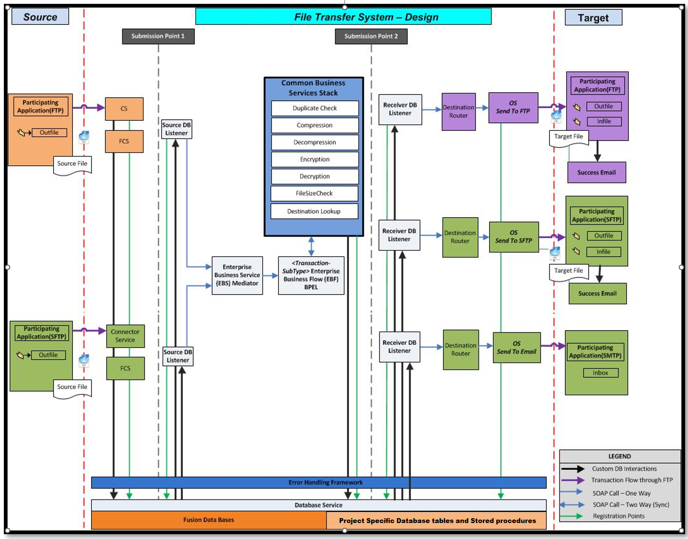
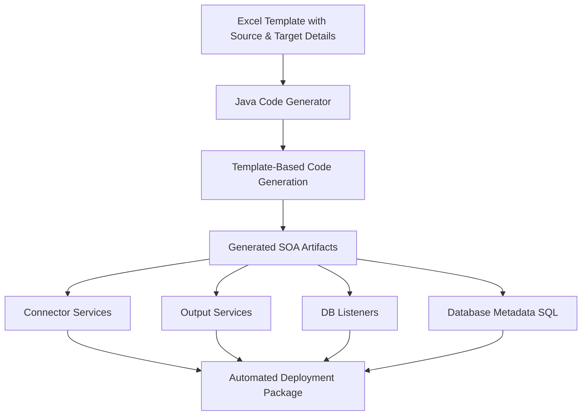

# Oracle SOA File Transfer System

This document describes the architecture and components of an enterprise-grade file transfer system developed using **Oracle SOA Suite**. The system is designed to be flexible, reusable, and auditable, supporting multiple sources and targets with centralized tracking and monitoring capabilities.  

This system was developed in 2009, extremely well received (it was a common tool for the entire Enterprise, being used for 400+ critical file transfers like Payroll files, Payment files like cheques, invoices, receipt, orders, suppliers etc), kept on upgrading from SOA10g to SOA11g to SOA12c, kept on improving and serving my organization, and ran in Production till 2021 (12 yrs) till it was migrated to newer OIC-based platform.  Some integrations were redeveloped using MFT Platforms like GoAnywhere and MOVEit.

---

## 🎯 Objective

To build an enterprise-scale file transfer framework that:
- Supports multiple source systems and destinations
- Applies reusable processing rules (encryption, compression, etc.)
- Provides configurable routing via database-driven metadata
- Offers enterprise-grade monitoring and resubmission capabilities
- Retains transaction history for up to 1 year for compliance

---

## 🧱 Architecture Overview

### Data Flow

1. Source files are placed in outfile directories of participating applications
2. Connector services establish connections to source systems
3. Files are picked by Connector service and placed temporarily in the database.  We use the File as attachment feature
4. The transaction now identifies the next steps using the database metadata configured for this integration. All intermediate steps, if any, like encryption, renaming are identified.
5. The Common Business Services Stack applies necessary operations (duplicate checking, compression, encryption, etc.)
6. The status of Processed files is detected by Receiver DB Listeners
7. Receiver DB Listener will direct files to the appropriate Output Service
8. Output Services deliver files to target applications using the appropriate protocol (FTP, SFTP, or SMTP)
9. Success emails are sent to confirm successful transfers

The architecture follows a **three-layered design pattern**:

### 1️⃣ Ingestion Layer (Source Integration)

- Connects to **multiple external systems** using various protocols (SFTP, FTP, DB, web services).
- Designed to **ingest files or messages** from these systems.
- Each source is defined in a **database table**, allowing plug-and-play connectivity with minimal custom code.
 
- **Connector Services (CS/FCS)** - Services responsible for establishing connections with source systems. This is a standalone SOA composite developed for each individual source system. They will have names like SOURCE10001, SOURCE10002, SOURCE20001.  However, templates for each pattern are available to clone and create this SOA Composite.

### 2️⃣ Processing Layer (Business Logic & Transformation)

- Performs dynamic, reusable operations such as:
  - **Encryption/Decryption**
  - **Compression/Decompression**
  - **Content transformation**
- This layer uses **central logic** that reads processing instructions from the database.
- Decouples business rules from integration code to maximize reusability.

### 3️⃣ Delivery Layer (Target Integration)

- Delivers processed files or messages to various destinations.
- Targets are also **database-driven**, allowing flexible routing.
- Examples: send file to internal systems, external SFTP servers, or cloud endpoints.

- **Output Services (OS)** - Specialized services for different delivery protocols.  This is a standalone SOA composite developed for each individual target. They will have names like TARGET10001, TARGET20001, TARGET20002.  However, templates for each pattern are available to clone and create this SOA Composite.
  - Send To FTP
  - Send To SFTP
  - Send To Email (SMTP)
- **Participating Applications** - Destination systems that receive processed files:
  - FTP Applications
  - SFTP Applications
  - Email (SMTP) Applications
- **Success Email** - Notification system for successful transfers

---

## 🔄 Dynamic Source/Target Mapping

- All routing and behavior is controlled by **metadata stored in database tables**.
- This design enables:
  - Rapid onboarding of new partners or systems
  - Minimal or zero code changes for source/target changes
  - High reuse of orchestration logic

---

## Automated Code Generation 

Over 12 years during which this project was active in Production, the system evolved from manual development of SOA composites to 95% automated code generation, where we used Excel sheet to fill in the source and target details, and Java code to clone and create SOA composites with all details filled in.  We reduced development time from 1 month to 20 minutes.  The Connector Service (CS), the output Service (OS), the DBListeners and the metadata to be inserted in the database via SQL commands was all generated by our system based on the input Excel file !

---

## 🖥️ Monitoring & Support Interface

### Problem

Oracle Enterprise Manager (EM) has limitations:
- Cannot provide easy search options, say based on source or target.  For ex, I want to search for all integrations which deliver files to Bank of America
- A dashboard that can quickly tell how many files were moved, how many are in error.  A support personnel wants to have this window open all the time on one of their screens.
- This is a multi-hop integration with multiple SOA composites.  It is not possible to resubmit based on state of transaction from the EM.  
- Lacks long-term (multi-month) transaction history
- Cannot generate reports based on source, target or both. Say I want to see all files delivered from Source system MENDY to target DALLY in last 7 days
- Not possible to have role based control. We wanted to give view to our customers too so that they can track their files.  In EM, it is unfeasible to segregate based on customers (using domains is not feasible as we have 50+ internal and 150+ external customers)
- The EM is simply too technical for a average business user to understand whats going on

### Solution

A custom **Oracle ADF-based Monitoring UI** was developed:
- Allows support teams to **monitor transactions** in real time
- **Search and filter** based on date, status, source, file ID, etc.
- **Resubmit failed transactions** with minimal effort
- Supports **role-based access control**

---

## 🕒 Audit & Retention

- The system stores metadata and audit logs for up to **1 year**, meeting audit and compliance standards.
- Audit trail includes:
  - Source and destination
  - Processing actions applied
  - Status history and timestamps
  - User-triggered resubmissions

---

## Extensibility

The architecture is designed to allow for easy addition of:
- New source systems
- Additional processing capabilities 
- New target delivery methods

  This extensibility is achieved through the database-driven configuration approach, minimizing custom coding requirements when onboarding new systems.
---
## Submission Points

Two submission points are defined in the architecture:
  - **Submission Point 1** - Entry point at the source layer for initiating new transfers
  - **Submission Point 2** - Entry point at the processing layer for reprocessing previously ingested data
  - These submission points enable manual intervention and resubmission of failed transactions, enhancing the system's reliability and supportability.
---
## 🧩 Technology Stack

- **Oracle SOA Suite** (BPEL, Mediator, File Adapter, DB Adapter)
- **Oracle ADF** (Monitoring UI)
- **Oracle Database** (Routing and audit metadata)
- **SFTP/FTP/Web Services** (Integration protocols)

---

## 📌 Key Features

- 🔌 Pluggable source/target integration via DB-driven routing
- ♻️ Reusable transformation and processing logic
- 👁️‍🗨️ Custom monitoring UI for enhanced visibility
- 🔐 Secure, encrypted transfers and audit logging
- 📅 1-year transaction history for audit compliance

---

## 📈 Scalability

This architecture serves as a **blueprint** for enterprise file integration. With minimal configuration and no major coding, new source-to-target flows can be added and managed at scale.

---
